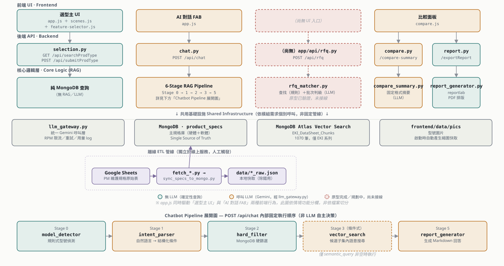
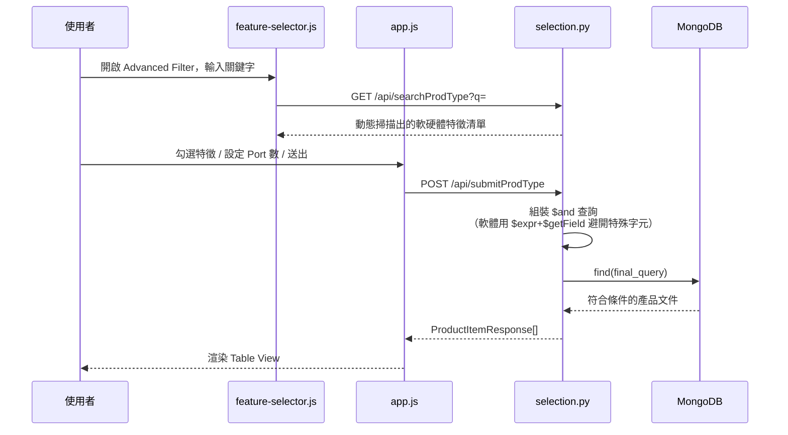
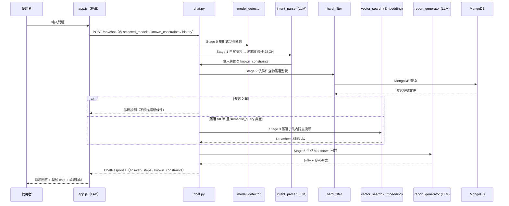
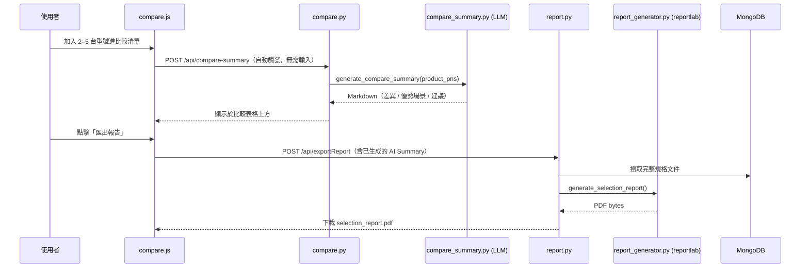
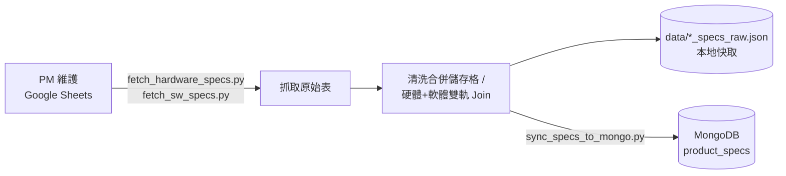

# 🏗️ Advantech AI Selection Tool — 軟體架構圖與說明

> 本文件取代舊版 Sprint 1 架構圖（Compare Panel / Vector Search 當時仍標示為 Planned，現已完成）。
> 盤點依據：`app/main.py`、`app/api/*.py`、`app/rag/*.py`、`app/models/*.py`、`frontend/js/*.js`（2026-08-04 現況）。
> `Plan/software_architecture_logic.md` 為同期舊文件，內容已被本文件涵蓋並更新，建議之後以本文件為準。

---

## 1. 整體分層架構

系統以**四個 UI 情境（Search/Filter、Chatbot、比較面板、RFQ）**為主軸，垂直分成前端 → 後端 API → 核心邏輯層三層，底部收斂到共用的 LLM Gateway 與資料庫。橘色虛線區塊代表已完成原型、但尚未接上 API/UI 的功能；Chatbot 的六段式管線因步驟較多，另外在下方展開成獨立的鏈狀圖，避免跟總覽圖擠在一起造成大量交叉線。

**怎麼讀這張圖：**
- 每一欄（lane）代表一個獨立的使用情境，由上到下分別是「使用者在前端做了什麼」→「打到哪個 API」→「後端核心邏輯」，同欄內是直上直下的關係，不會跟其他欄交叉。
- 「選型主 UI」欄是主要選型流程：場景範本（`scenes.js`）套用預設條件、或使用者手動調整／用 Advanced Filter（`feature-selector.js`）搜尋特徵，最後都彙整到 `app.js` 送出 `POST /api/submitProdType` 並渲染 Table View；`feature-selector.js` 本身只呼叫 `GET /api/searchProdType` 產生特徵下拉選單，不是獨立的送出路徑。
- `app.js` 同時是「選型主 UI」與「AI 對話 FAB」兩欄的實作檔案（同一支 2500+ 行的檔案身兼兩種前端職責）——圖是依**情境功能**分欄，不是依**檔案**分欄，這點特別用圖中註記標出來，避免誤會成兩支不同程式。
- 比較面板欄在 API／核心邏輯層拆成左右兩個子模組，因為 `compare.js` 同時驅動「AI 摘要（呼叫 LLM）」與「匯出 PDF（不呼叫 LLM）」兩件事。
- 「共用基礎設施」不是某一欄專屬，而是所有欄依各自需求個別呼叫——例如 Search/Filter 欄完全不碰 `llm_gateway.py`，只查 MongoDB。
- 離線 ETL 管線畫在資料層下方，用不同顏色的虛線框標示：它獨立於線上服務之外，由工程師手動觸發，不是使用者請求會經過的路徑。
- 最下面的「Chatbot Pipeline 展開圖」是 Core Logic 欄裡 `chat.py` 那個框的細節放大——五個 Stage 是寫死的固定順序，Stage 3 為虛線框，代表只在 `semantic_query` 非空時才會執行。

> 圖檔為向量 SVG（[Plan/assets/architecture-overview.svg](assets/architecture-overview.svg)），可直接用瀏覽器開啟放大檢視，或用向量繪圖工具（Figma / Illustrator）開啟後整份重畫、調整排版。

---

## 2. 核心流程時序圖

### 2.1 手動篩選（Advanced Filter / Table View）

不涉及 LLM，全部在 MongoDB 查詢層完成。

### 2.2 Chatbot 對話（`/api/chat` 六段式管線）

順序固定，非 LLM 自主決策；LLM 僅在 Stage 1 / Stage 5 被呼叫（Stage 3 有語意搜尋才會額外呼叫 Embedding）。

### 2.3 比較面板：AI Summary + PDF 匯出

### 2.4 離線資料同步（工程師手動觸發，非線上服務一部分）

---

## 3. 模組說明

### 3.1 前端（`frontend/`）

| 檔案 | 職責 |
|---|---|
| `index.html` | 系統唯一入口頁面，左側篩選區 + 中間 Table View + 右下角 FAB Chatbot + 比較面板 |
| `js/app.js`（2500+ 行） | 前端狀態中樞：`API_BASE` 自動偵測（localhost vs. Cloudflare Tunnel）、場景/手動篩選狀態管理、`submitProdType` 呼叫與表格渲染、Chatbot 訊息送出與 Markdown 渲染、`known_constraints` 跨輪次狀態維護 |
| `js/scenes.js` | 應用場景模板（鐵路 / 電力 / 工廠等）的預設條件定義，供 `app.js` 套用 |
| `js/feature-selector.js` | Advanced Filter 特徵搜尋 UI，動態讀取 `/api/searchProdType` 產生的清單；`FS_SOFTWARE_HIDDEN` 旗標目前關閉軟體卡片顯示（資料尚未完全驗證） |
| `js/compare.js`（630+ 行） | 比較面板，`CMP_SECTIONS` 可擴充設計描述比較維度；呼叫 AI Summary 與 PDF 匯出 |
| `js/sfp-selector.js` | 光纖模組選型，純前端邏輯，讀取靜態 `frontend/data/sfp_modules.json`，**不呼叫後端** |
| `js/config.js` | 部署用 Cloudflare Tunnel API 位址設定 |
| `css/*.css` | 依功能區塊拆分樣式（`style.css` 主樣式、`feature-selector.css`、`compare.css`、`table-view.css`） |

### 3.2 後端 API 層（`app/api/`, `app/main.py`）

| 檔案 | Endpoint | 職責 |
|---|---|---|
| `main.py` | — | FastAPI 進入點：`lifespan` 啟動時連 MongoDB + 初始化 LLM Gateway + 產生圖片縮圖；CORS；開發模式 JS/CSS 免快取；全域攔截 `PyMongoError`；掛載四條 router + 靜態資源 |
| `selection.py` | `GET /api/searchProdType` `POST /api/submitProdType` | 動態掃描 DB 產生軟硬體特徵清單；純 MongoDB `$and` 查詢組裝（軟體 key 含特殊字元時用 `$expr`+`$getField` 避開 dot-notation 限制） |
| `chat.py` | `POST /api/chat` | RAG Chatbot 主端點，依序呼叫 `model_detector → intent_parser → hard_filter → vector_search（條件式）→ report_generator`，詳見 2.2 |
| `compare.py` | `POST /api/compare-summary` | 呼叫 `compare_summary.py` 生成固定格式的比較摘要 |
| `report.py` | `POST /api/exportReport` | 撈取選定型號完整規格，交給 `app/report_generator.py`（reportlab）產出 PDF |

### 3.3 RAG / AI 處理層（`app/rag/`）

| 檔案 | 階段 / 用途 | 是否呼叫 LLM |
|---|---|---|
| `model_detector.py` | Stage 0：regex 判斷訊息是否明確提到型號（`EKI-`/`ADAM-`） | 否 |
| `intent_parser.py` | Stage 1：自然語言 → 結構化篩選條件 JSON | 是 |
| `hard_filter.py` | Stage 2：依結構化條件 + 已鎖定型號組 MongoDB 查詢 | 否 |
| `vector_search.py` | Stage 3：候選子集內對 Datasheet Chunk 做向量搜尋，處理主庫 PN 與 Chunk 型號命名落差 | 是（Embedding） |
| `report_generator.py` | Stage 5：候選規格 + 語意片段 → Markdown 回答 | 是 |
| `compare_summary.py` | 比較面板固定格式摘要（無需 Intent Parser，不帶對話歷史） | 是 |
| `datasheet_expert.py` | 外部 Product Expert API 包裝，**僅供 `CHAT_TEST_MODE=datasheet_api` 評估模式使用**，不在正式路徑上 | 是（外部服務） |
| `rfq_matcher.py` | RFQ 需求逐項判級原型：查找（deterministic）與判級（LLM）分離，同 category 批次呼叫；**已用真實資料驗證，但尚未有 API endpoint 或前端入口** | 是（批次） |

### 3.4 共用基礎設施

| 檔案 | 職責 |
|---|---|
| `app/database.py` | MongoDB 單例連線（`Database` class），預設連 `advantech_ind_sw_tool`；`vector_search.py` 另外透過共用 `client` 存取 `Adv_Ind_Switch` DB |
| `app/llm_gateway.py` | 所有 Gemini 呼叫的唯一入口：`TASK_MODELS`（`intent`/`report`/`rfq_verdict`）依任務對應模型、RPM 限流、重試、JSON 解析保護、用量 log（`logs/llm_usage.log`） |
| `app/models/chat.py` / `app/models/selection.py` | Pydantic Request/Response 強型別定義 |

### 3.5 資料層

- **`advantech_ind_sw_tool.product_specs`**（MongoDB）：結構化硬體 + 軟體規格，Single Source of Truth，供選型 API 與 Hard Filter 使用。軟體規格（`software.{category}`）目前僅涵蓋 **11 個 EKI 系列**。
- **`Adv_Ind_Switch.EKI_DataSheet_Chunks`**（MongoDB Atlas Vector Search）：1070 筆 Datasheet 切片，3072 維 `gemini-embedding-2-preview` 向量，索引已 READY，同樣僅涵蓋 EKI 系列。同資料庫下的 `Sales_Kit_Chunks` 目前是空集合，尚未接。
- **`frontend/data/pics` / `pics_thumb`**：型號圖片，啟動時自動產生縮圖快取。
- **`data/*_specs_raw.json`**：離線 ETL 產生的本地快取，非線上服務直接讀取，供同步腳本除錯用。
- **Google Sheets**：PM 維護規格的原始表，透過 `scripts/` 內腳本人工觸發同步進 MongoDB。

---

## 4. 現況與已知缺口

- **RFQ 逐項比對**：後端邏輯（`rfq_matcher.py`）已完成原型並驗證，但**尚未有 `app/api/rfq.py` endpoint、`app/models/rfq.py` schema，也沒有前端上傳入口**——是目前架構圖裡唯一「有實作、沒接線」的區塊。
- **Chatbot Stage 4（Re-ranking）**：規劃中但尚未實作。
- **軟體規格覆蓋範圍**：僅 11 個 EKI 系列有 `software` 欄位資料，不含 iMC、ADAM 等其他產品線；前端 Feature Selector 的軟體卡片因此暫時關閉（`FS_SOFTWARE_HIDDEN = true`）。
- **Datasheet 向量搜尋覆蓋範圍**：同樣僅 EKI 系列（1070 筆 chunk），`Sales_Kit_Chunks` 未接。
- **`CHAT_TEST_MODE`**：`.env` 可切換的評估開關（`datasheet_api` / `vector_search`），會整個繞過正式 6 段式管線，只在人工評估時使用，非正式請求路徑。
